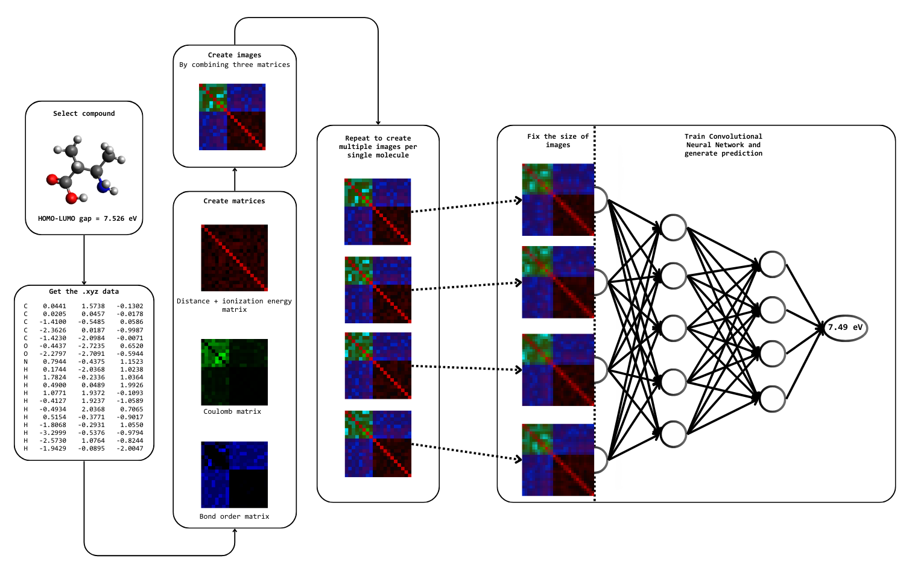

# 🟥🟩🟦 RGBChem
RGBChem is a procedure for predicting the properties of chemical compounds using the conversion of chemical properties to RGB images.

## 🚀 Quickstart
The best way to begin is by exploring the `working_demo.ipynb` file, where we introduce the workflow used to train the original models.

## How to run 

## 🧠 Main concept

RGBChem is a novel approach for converting chemical compounds into image representations, which are subsequently used to train a convolutional neural network (CNN) to predict different chemical properties (HOMO–LUMO gap for now). By addressing the artificial order present in .xyz files—used to generate these images—it has been demonstrated that expanding the initial training set size can be achieved by creating multiple unique images (data points) from a single molecule. Presented approach leads to a statistically significant improvement in model accuracy, highlighting RGBChem as a powerful approach
for leveraging machine learning (ML) in scenarios where the available dataset is too small to apply ML methods effectively.

## 🖥️ Software
We use the `fastai` ([link](https://github.com/fastai/fastai)) library to facilitate the deep learning training process. All other dependencies are fairly standard and have been listed in `requirements.txt`.

## Project structure

## Cite us
