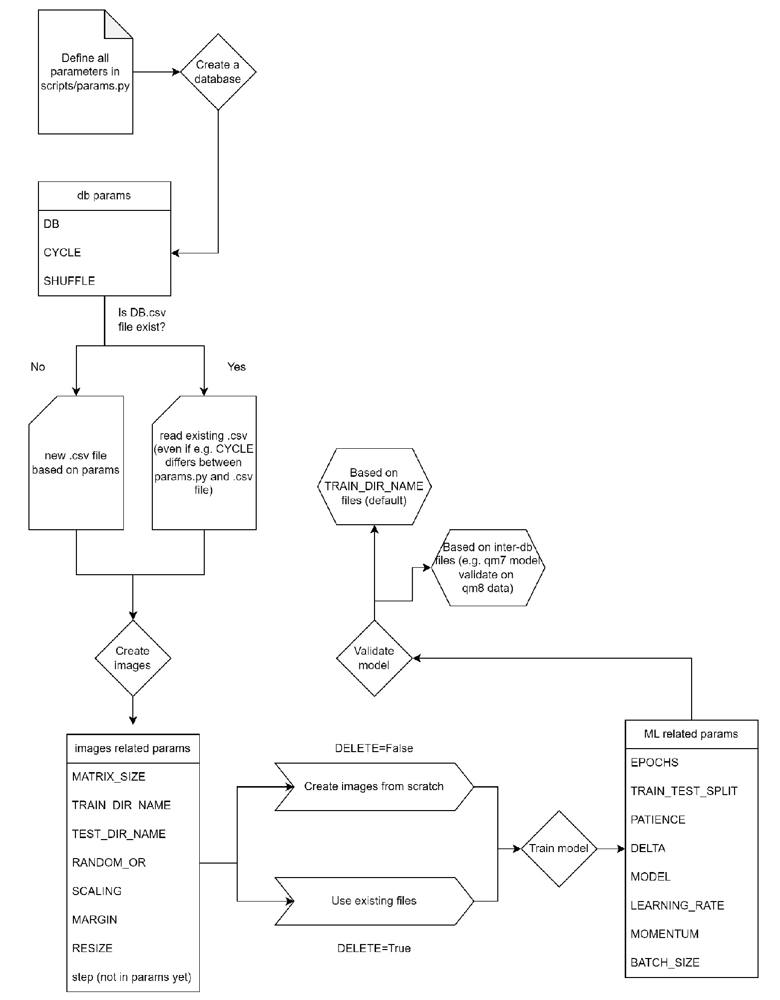

# RGBChem
------------------
RGBChem is a procedure for predicting the properties of chemical compounds using the conversion of chemical properties to RGB images

## 🚀 Quickstart
The best way to begin is by exploring the `working_demo.ipynb` file, where we introduce the workflow used to train the original models.

## Main concept

